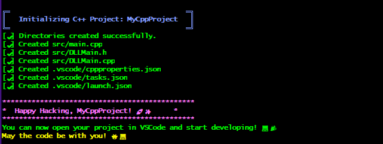

# Codesmith

Welcome to the **Codesmith**! This simple script helps you quickly set up a C++ or Lua project with all the necessary folders, files, and configurations. It also supports committing changes to Git! 🎉

---

## Features ✨

- **C++ Project Setup**: Automatically creates the folders and files you need to start a C++ project, including:

  - `src/main.cpp` with a basic "Hello, World!" program.
  - Files for DLL support (`src/DLLMain.h`, `src/DLLMain.cpp`).
  - VSCode configurations for easy development.

- **Lua Project Setup**: Creates a basic Lua project with:

  - `src/main.lua` to print a message.
  - VSCode settings for Lua development.

- **Commit Changes**: You can commit changes to Git with a custom commit message using the `commit` command. 💻

---

## How to Use 🛠️

1. **Download the Script**: Download or copy the script to your terminal.

2. **Run the Script**: Run the script with the language and project name.

   ```bash
   ./codesmith.sh <language> <project_name>
   ```

   - `<language>`: Choose `cpp` for C++ or `lua` for Lua.
   - `<project_name>`: Your project's name.

3. **Commit Changes**: You can also commit your changes directly with the script:

   ```bash
   ./codesmith.sh commit "Your commit message"
   ```

### Windows usage

1. Place this file into `C:\Users\YOUR_USERNAME`
2. Run `source .bashrc`
3. You do not need anymore to specify the bash file location. Now run `codesmith <PARAMETERS>`

---

## Example Usage 🎬

### C++ Project 🎯

To create a C++ project called `MyCppProject`, run:

```bash
./codesmith.sh cpp MyCppProject
```

The script will create:

- The `src` folder with `main.cpp`, `DLLMain.h`, and `DLLMain.cpp`.
- The `.vscode` folder with setup files for VSCode.

Example output:



### Lua Project 🎯

To create a Lua project called `MyLuaProject`, run:

```bash
./codesmith.sh lua MyLuaProject
```

The script will create:

- The `src` folder with `main.lua`.
- The `.vscode` folder with Lua settings.

Example output:

## 

## Commit Changes 💥

To commit changes from the script, use the `commit` command:

```bash
./codesmith.sh commit "Initial commit"
```

The script will:

- Add all changes (`git add .`).
- Commit with your message.
- Push to the remote repository.

Example output:


---

## Error Handling 💡

If you forget to provide a project name or commit message, the script will show a friendly error like this:


---
